# Forms

## Introduction

Some parts of our application use, so called, "fields" endpoints to render Forms in UI.

This is powered by a simple form fields system, where the POST endpoints receives a "form" payload that is defined by its "fields" endpoints.

    
**Example:**

`GET /users/{userId}/namedDepositors/fields` - returns a list of these "fields":
- `nameMessage` - type: message
- `name` - required, type: text
- `description` - required, type: text

and the `POST /users/{userId}/namedDepositors` - sets up a named depositor, expects these fields:
- `name`
- `description`

This way of serving form fields is a UI-focused approach. It allows us to easily
update forms in our applications when business rules require this. The forms in our applications are rendered
automatically based on the fields definitions.

For server-side API clients access, using a "fields" endpoint may not always be necessary. For example, the 
Named Depositor fields are not likely to change and they don't depend on a user or any other parameter.

However, certain endpoints like `/countryAccountConfigs/{countryId}` return a list of fields that is different
based on the selected `countryId`.

The field definition object supports much more field types than currently required for Named Depositors or setting
up a User Account. It is used by our applications to render UI in other parts of the application, not covered by
this API. However, it is likely that new features added to this API will use Forms.

### Field structure

```js
{
    "type": "text",                     // the field type
    "name": "firstname",                // the name of the field
    "label": "What's your first name?", // the field label
    "required": true,                   // if the field is required
    "meta": [],                         // an array of meta tags
    "filters": [],                      // an array of filters
    "validators": []                    // an array of validators
}
```

## Field types

Each field type supports some "meta tags" (given in the `meta` property). These tags control a more fine-grained behaviour & look of the inputs. 

In this documentation, a notation like `attribute:group:Foo` means a meta entry like this:
```js
{
    type: "attribute",
    value: "group",
    label: "Foo"
}
```

### List of field types:


#### `text`

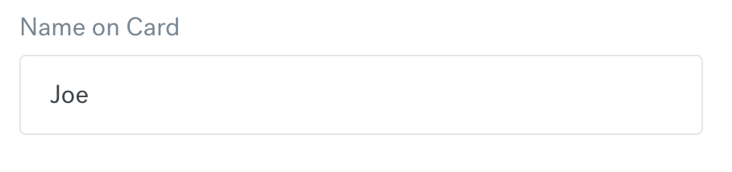

A typical text input field.

The text input is the most used field type, and has the most meta tags that can change how it looks. Navigate to meta tag documentation to see examples. 

Applicable meta tags: [`format`](#format), [`placeholder`]($placeholder), [`image`](#image), [`button`](#button), [`attribute`](#attribute), [`hidden`](#hidden).

#### `textarea`

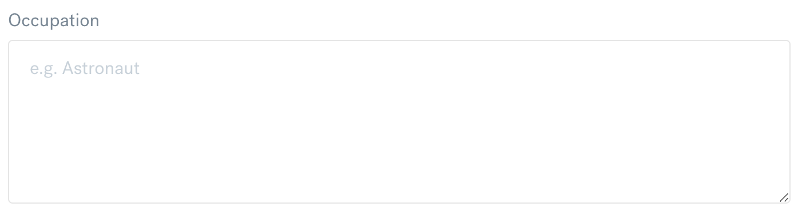

A textarea field.

Applicable meta tags: [`placeholder`](#placeholder), [`attribute`](#attribute).

#### `list`

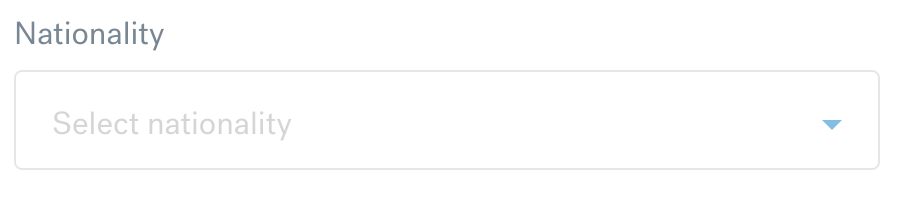

A single selection list field. Typically rendered as dropdown.

Applicable meta tags: [`item`](#item), [`additionalFields`](#additionalfields), [`placeholder`](#placeholder), [`attribute`](#attribute).

#### `checkbox`

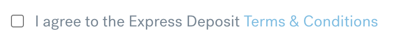

A checkbox field.

Applicable meta tags: [`url`](#url), [`modal`](#modal), [`attribute`](#attribute), [`hidden`](#hidden).

#### `date`

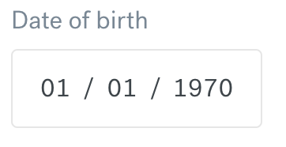

An date field.

The date format is controlled by `attribute:format:<>` meta tag. It can have following values:
- `date` - should be rendered as full date input field (day, month and year), in a format that is client specific. When sending this value to API it should be sent as ISO-8601 compatible date.
- PHP's `date` function format - example: `m/y` renders 31st of October as "31/11". When sending this value to API it should be sent "as is".

Applicable meta tags: [`placeholder`](#placeholder), [`attribute`](#attribute).

#### `captcha`

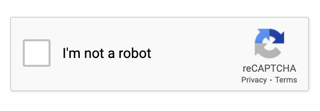

A captcha field.

The site key is provided in `attribute:siteKey` meta tag.
Applicable meta tags: [`attribute`](#attribute).

#### `message`
A paragraph of text to be displayed to user.
Applicable meta tags: [`url`](#url), [`modal`](#modal), [`attribute`](#attribute).

#### `multiSelect`
A multi selection list.
Applicable meta tags: [`attribute`](#attribute), [`hidden`](#hidden).

#### `file`
A file upload field.
Applicable meta tags: [`attribute`](#attribute).

#### `uploadedFile`
Used as a banner indicating that the file is already uploaded.
The `attribute:notes` meta tag provides an additional text to be displayed under the upload input. We use this to show the name of the uploaded file.

#### `awaitingFile`
Used as a banner indicating that a previous file is required to be uploaded.
The `attribute:notes` meta tag provides an additional text to be displayed under the upload input. We use this to inform the customer that the first upload must be completed before the next one is started.

#### `image`
An image field to indicate an image is to be displayed.
The `attribute:src` meta indicates the API endpoint to get image URL from.

### List of meta tags

#### `attribute`
Generic meta tag to provide various information. This should be device agnostic but based on HTML5 input tag `attribute` property.

The `value` holds the name of attribute, the `label` holds the value to be set.

Attributes used in our forms:
- `attribute:group` - the `label` holds a group name for an input. If two inputs next to each other are of the same group, it is expected that these fields will be put next to each other, or somehow joined. The implementation of this is up to client.
Example of grouped input fields:
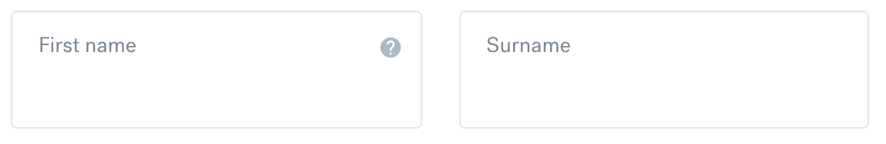

- `attribute:type:password` - this should render a password-like input, with masked characters.
Example:
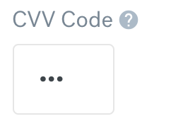

- `attribute:allowedCharacters` - the `label` holds a regex for a single character in the input field. Ex. `[0-9]` means only characters 0-9 are allowed to be entered into the field.

- `attribute:format` - for `datetime` the `label` of this attribute holds the same format string as for the `datetime` validator.

#### `hidden`
Fields with this flag should be hidden from view but should be populated with the default value provided. These fields should be sutmited with the rest of the form.
The purpose of these fields is to include hidden values in the form that will be submitted. Text `text` field can hold a string value, `checkbox` can hold a boolean value and `multiSelect` can hold an array of strings.
Used by field types: [`text`](#text), [`checkbox`](#checkbox), [`multiSelect`](#multiSelect)

#### `format`
Specifies the format of an input field. This is based on the HTML5 input element [`type` parameter](https://developer.mozilla.org/en-US/docs/Learn/Forms/HTML5_input_types).

Example:
```js
{
    "type": "format",
    "value": "tel",
    "label": null
}
```
Renders an input field with HTML's `type="tel"` attribute, causing the popup keyboard on mobile devices to use the telephone layout.

Example:
```js
{
    "type": "format",
    "value": "password",
    "label": null
}
```
Renders a password input field.

Used by field types: [`text`](#text)

#### `placeholder`
The placeholder to show when an input is empty.

Used by field types: [`text`](#text), [`textarea`](#textarea), [`list`](#list), [`checkbox`](#checkbox), [`date`](#date)

#### `image`

Used to render icon(s) inside text field. This is more of a hint what is expected to be shown in the UI.

Example:
```js
{
    "type": "image",
    "value": "/images/102",
    "label": "VISA"
},
{
    "type": "image",
    "value": "/images/103",
    "label": "MASTERCARD"
}
```

Renders:

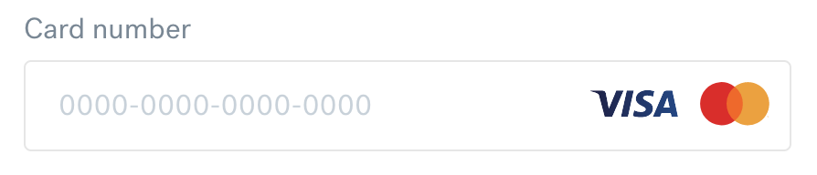

Used by field types: [`text`](#text)

#### `button`

Used to indicate that it is expected to have some kind of button/functionality inside/near the input field. This is more of a hint.

Example:
```js
{
    "type": "button",
    "value": "visibility",
    "label": null
}
```

Placed as meta for the "password" type input field and indicates that a button to toggle password visibility is expected.

Used by field types: [`text`](#text)

#### `item`

Use this to add list entries into select/multiSelect fields.

Example:
```js
{
    "type": "item",
    "value": "1",
    "label": "USA"
},
{
    "type": "item",
    "value": "44",
    "label": "Aruba"
},
{
    "type": "item",
    "value": "2",
    "label": "Australia"
}
```

Renders:

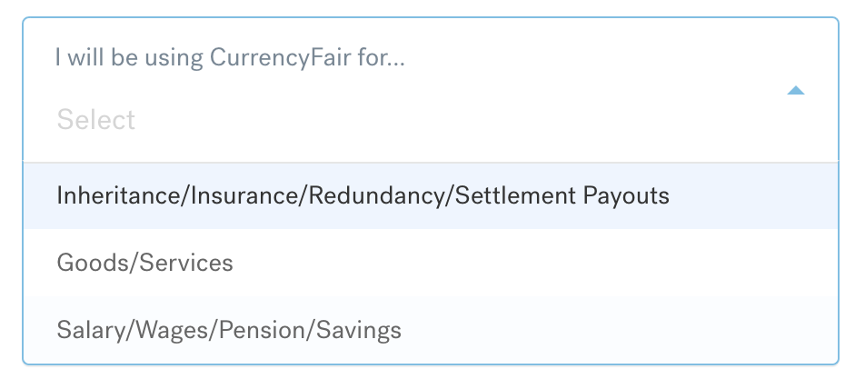

Used by field types: [`select`](#select), [`multiSelect`](#multiselect)

#### `url`

This meta tag will cause the part of the field description described in `label` property to become a link to the URL from the `value` field. The link should open in new tab/window.

Example:
```js
{
    "type": "url",
    "value": "https://www.currencyfair.com/express-deposits-terms-conditions",
    "label": "Terms & Conditions"
}
```

Renders:


Used by field types: [`checkbox`](#checkbox), [`message`](#message)

#### `modal`

This meta tag will cause the part of the field description described in `label` property to become a link/button that opens a modal window with text from `value`. The value can contain basic HTML tags.

Example:
```js
{
    "type": "modal",
    "value": "<h1>Customer Identification by CRB</h1><p>We may verify your identity using information held by a CRB (Credit Reporting Body). To do this we may disclose personal information such as your name, date of birth, and address to the CRB to obtain an assessment of whether that personal information matches information held by the CRB.</p>",
    "label": "Credit Review Body"
}
```

Used by field types: [`checkbox`](#checkbox), [`message`](#message)

#### `additionalFields`

This meta tag causes the form renderer to fetch additional fields from API, and render them below the field that this meta tage is on.

The `value` property holds the URL from which the fields should be fetched. It contains the `{value}` tag, which should be replaced with url-encoded value of the field.

In case if the field has the `attribute:value` meta tag, it should load the additional fields for that value immediately upon being rendered on screen.

Example:
```js
{
    "type": "additionalFields",
    "value": "/customerSupport/contactForm/fields?subject={value}",
    "label": null
}
```

This tag was added on a `list` field that looks like this:

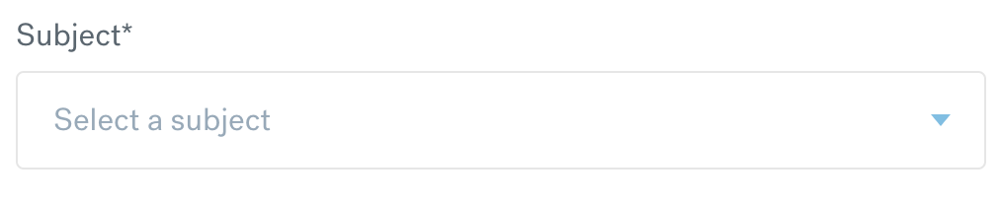

Once an entry with value `11` was selected from this dropdown, the application made an API call to:
```
GET /customerSupport/contactForm/fields?subject=11
```

And received these fields to render:
```js
[
    {
        "name": "query",
        "type": "textarea",
        "label": "Describe your query",
        "required": true,
        "meta": [
            {
                "type":"placeholder",
                "value":"Please include as much information about your query as possible",
                "label":null
            }
        ],
        // ...
    }
]
```

Which were rendered below the select field:

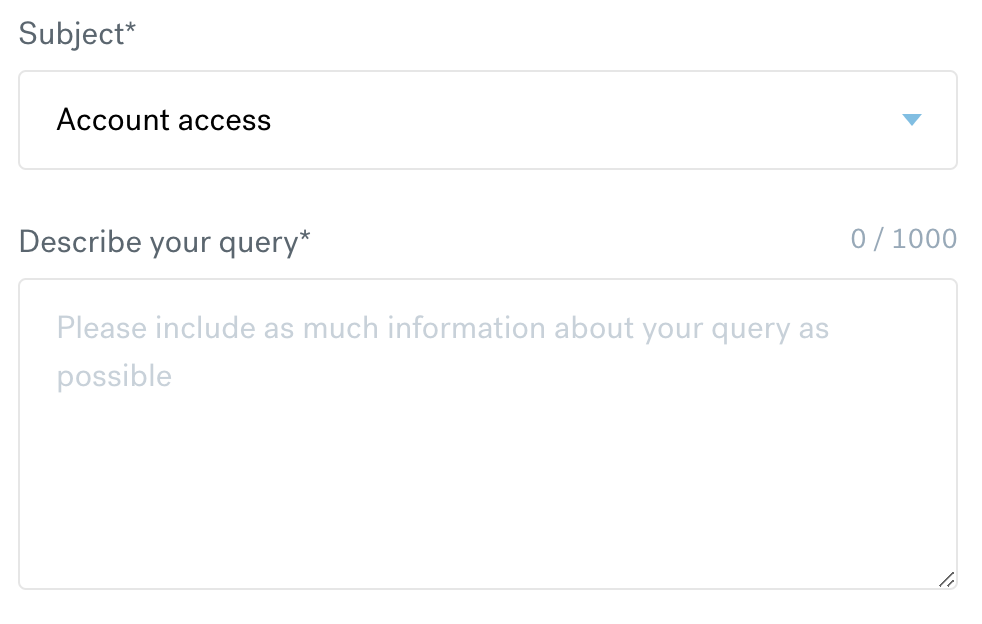

Used by field types: [`list`](#list)

## Filters

Fields can have any number of filters attached to them. The role of filter is to control the way in which the data is entered in the input field.

The field filter definitions are also used by the API to perform an input filtering on the data that the form submits to an API endpoint.

For example if the field only allows digits, and the value `1234abc567`, is sent to API, it will be filtered into `1234567`.

#### Filter structure

```js
{
    "filter": "trim"  // name od the filter
}
```


### List of filters

#### `boolean`

Allows the field to only have a boolean value. The API expects to get a value that casts to boolean, so values like numeric 0/1 can be used as well.
This is mainly used for the [`checkbox`](#checkbox) field type.

#### `digits`

Only digits characters (0-9) are allowed in the field.

#### `trim`

Trims the whitespace from beginning and end of the input.

#### `stripWhitespace`

Removes any whitespace from the input.

## Validators

A field can have any number of validators attached to them. The role of the validators is to determine if the value entered into field is valid.

Fields that are marked "required" by default should be checked to contain a value, even without having any validator defined.

The field validators definitions are also used by the API to perform an input validation on the data that the form submits to an API endpoint.

The `message` property provides the text to show if the validation fails.

#### Validator structure

```js
{
    "validator": "minMax",            // name of the validator
    "rules": {                        // validation rules
        "min": 0,
        "max": 10
    },
    "message": "Too many characters"  // the validation message to show
}
```

### List of validators

#### `alphanumeric`

Validates the input to only contain 0-9, a-z and A-Z characters.
May also allow space character, and if this is the case it will be specified in the `rules.pattern` property of the filter. 

Rules:
- `pattern` &lt;string&gt; - optional - if provided, the validator should validate the input using RegExp rules provided in `pattern`.

Example:
```js
{
    "validator": "alphanumeric",
    "rules": {
        "pattern": "[a-zA-Z0-9]+"
    }
}
```

#### `datetime`

Validates the input to be a date in the given format.

Rules:
- `format` &lt;string&gt; - optional - the date format, ISO-8601 if not provided
- `min` &lt;string&gt; - optional - date must after or equal the `min` date to pass validation
- `max` &lt;string&gt; - optional - date must be before or equal to the max date to pass validation

Example:
```js
{
    "validator": "datetime",
    "rules": {
        "max": "2001-04-23"
    },
    "message": "You must be 18 years old or above to open a CurrencyFair account."
}
```

#### `digits`

Validates the input to only contains digits (0-9).

Rules:
- none

#### `email`

Validates the input to be a valid email address.

Rules:
- none

#### `fileExtension`

Validates the uploaded file extension against a list of extensions (case-insensitive).

Rules:
- `extensions` &lt;string&gt; - coma separated list of extensions

Example:
```js
{
    "validator": "fileExtension",
    "rules": {
        "extension": "png,pdf,jpg,jpeg"
    },
    "message": "We can only accept files with extensions .jpg .png or .pdf. Please re-upload one of these file types."
}
```

#### `fileSize`

Validates the uploaded file size is within given limits.

Rules:
- `min` &lt;integer&gt; - minimal file size in bytes
- `max` &lt;integer&gt; - maximal files size in bytes

Examples:
```js
{
    "validator": "fileSize",
    "rules": {
        "min": 1,
        "max": 5242879
    },
    "message": "The maximum file size you can upload is 5Mb, please upload a smaller file."
},
```

#### `greaterThan`

Validates that the numeric value of the field is greater than a given number.

Rules:
- `min` &lt;number&gt; - the minimum value (not inclusive)

Examples:
```js
{
    "validator": "greaterThan",
    "rules": {
        "min": 0
    },
    "message": "You must choose an estimate average transaction size"
}
```

#### `isCountable`

Validates that the input provided is a collection of items, with optional min/max/count limits on the number of entries.

Rules:
- `min` &lt;number&gt; - optional - the minimum number of items required
- `max` &lt;number&gt; - optional - the maximum number of items allowed
- `count` &lt;number&gt; - optional - the exact number of items that the collection must contain

Examples:
```js
{
    "validator": "isCountable",
    "rules": {
        "count": 3
    },
    "message": "You should select 3 currencies"
}
```

#### `minMax`

Validates the input string length.

Rules:
- `minlength` &lt;number&gt; - the minimum length required
- `maxlength` &lt;number&gt; - optional - the maximum length of input string
- `showCounter` &lt;boolean&gt; - optional - if true, the input field should show a count of entered characters

Example:
```js
{
    "validator": "minMax",
    "rules": {
        "minlength": 2,
        "maxlength": 32,
        "showCounter": true
    },
    "message": "The value that you've provided is not the correct length. Please enter the correct length and retry."
}
```

Renders:


#### `notEmpty`

Validates that the input has a value. In case of checkboxes, this validates if the checkbox is checked. For list fields, it validates if any selection was made.

Rules:
- none

Example:
```js
{
    "validator": "notEmpty",
    "message": "Please agree to our Terms and Conditions."
}
```

#### `number`

Validates if the input is a correct number. The number can have a decimal part. Example valid numbers: `1234`, `123.45`, `0.123456`.

Rules:
- none

Example:
```js
{
    "validator": "number",
    "message": "This is not a valid number"
}
```

#### `paymentCard`

Validates payment card number, by checking its checksum and checking if a detected card vendor is on a list of supported issuers.
Vendor detection can be implemented using one of the available libraries, for example https://github.com/danbahrami/cardsy.

Rules:
- `issuers` - &lt;array&gt; - array of card vendor names. Possible values: `VISA`, `MASTERCARD`, `AMEX`, `DANKORT`, `DINERSCLUB`, `DISCOVER`, `JCB`, `LASER`, `MAESTRO`, `UNIONPAY`, `VISAELECTRON`.

Example:
```js
{
    "validator": "paymentCard",
    "rules": {
        "issuers": [
            "VISA",
            "MASTERCARD"
        ]
    },
    "message": "Please enter a valid VISA or MASTERCARD debit number."
}
```

#### `captcha`

The validation of captcha is done server-side, but the validator is outputed on list of validators, to provide the messsage to show to customer.

Rules:
- none

#### `regex`

Validates input string using Regular Expressions.

Params:
- `jsRegexp` - &lt;string&gt; - regular expression compatible with JavaScript RegExp.
- `pcreRegex` - &lt;string&gt; - PCRE compatible expression.

Examples:
```js
{
    "validator": "regex",
    "rules": {
        "jsRegex": "^[\\x20\\x22\\x25\\x3F\\x5FA-Za-z]+$",
        "pcreRegex": "^[\\x20\\x22\\x25\\x3F\\x5FA-Za-z]+$"
    },
    "message": "Please enter your full name, as it appears on your payment card."
}
```

#### `remoteValidator`

Validates the content of one or more input fields using a HTTP call.
The validation should be started by a change in the input field on which the `remoteValidator` is attached.
Any number of fields values can be sent at once, as required by validator's rules.

The HTTP call should be of type POST, with JSON payload attached, containing a simple object with names and values of fields.

The `message` property of the validator is ignored. The HTTP call returns messages to show to customer. More on that below.

Rules:
- `url` - &lt;string&gt; - the URL to POST data to
- `fields` - &lt;array&gt; - array of fields that should be sent for validation. Each entry contains an object like: `{ "start": <number>, "length": <number or null> }`.

The validator should only include the part of the field value starting from `start`, and counting `length` number of characters.

Example:
```js
{
    "validator": "remoteValidator",
    "rules": {
        "url": "/binCheck",
        "fields": {
        "cardNumber": {
            "start": 0,
            "length": 7
        },
        "depositCurrencyCode": {
            "start": 0,
            "length": null
        }
        }
    },
    "message": null
}
```

For an example form with these values:
```
depositCurrencyCode: "EUR"
cardNumber: "4111-1234-1234-1234"
```

The above validator will send these values to the HTTP POST call:

```js
// POST /binCheck
{
    "depositCurrencyCode": "EUR", // entire value of depositCurrencyCode field
    "cardNumber": "4111-12"       // first 6 characters of cardNumber
}
```

Example of error messages in the POST call response:
```js
{
    "valid": false,  // reeturns true if the values are valid
    "messages": [    // array of error messages
        "InvalidCardNumber": "Unfortunately this card is not supported"
    ]
}
```

Example of warning messages in the POST call response:
```js
{
    "valid": true,  // reeturns true if the values are valid
    "messages": [   // array of error messages
        "DepositCurrencyWarning": "Please ensure this is a EUR card before proceeding as your bank may charge you an extra fee."
    ]
}
```

The `messages` should be displayed as "errors" if `valid: false`, or as "warnings" if `valid: true`.

Example of passed validation in the POST call response:
```js
{
    "valid": true,
    "messages": []
}
```

## Example

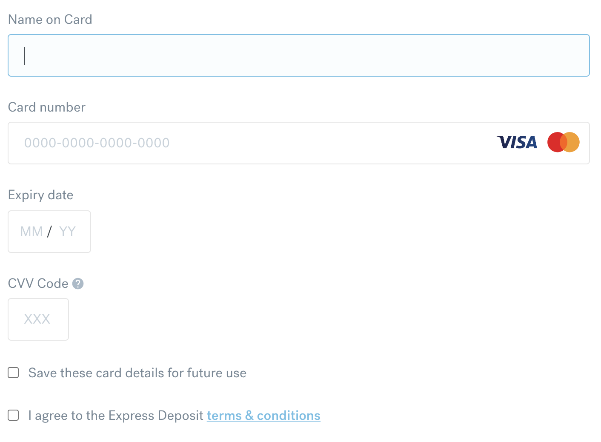

Definitions:
```js
[
    {
        "name": "cardName",
        "type": "text",
        "label": "Name on Card",
        "required": true,
        "validators": [
            {
                "validator": "minMax",
                "rules": {
                    "minlength": 2,
                    "maxlength": 32
                },
                "message": "The value that you've provided is not the correct length. Please enter the correct length and retry."
            },
            {
                "validator": "regex",
                "rules": {
                    "regexvalue": "^[\\x20\\x22\\x25\\x3F\\x5FA-Za-z]+$",
                    "jsRegex": "^[\\x20\\x22\\x25\\x3F\\x5FA-Za-z]+$",
                    "pcreRegex": "^[\\x20\\x22\\x25\\x3F\\x5FA-Za-z]+$"
                },
                "message": "Please enter your full name, as it appears on your payment card."
            }
        ],
        "filters": [
            {
                "filter": "trim"
            }
        ]
    },
    {
        "name": "cardNumber",
        "type": "text",
        "label": "Card number",
        "required": true,
        "meta": [
            {
                "type": "format",
                "value": "cardNumber",
                "label": null
            },
            {
                "type": "placeholder",
                "value": "0000-0000-0000-0000",
                "label": null
            },
            {
                "type": "image",
                "value": "/images/102",
                "label": "VISA"
            },
            {
                "type": "image",
                "value": "/images/103",
                "label": "MASTERCARD"
            }
        ],
        "validators": [
            {
                "validator": "paymentCard",
                "rules": {
                    "issuers": [
                    "VISA",
                    "MASTERCARD"
                    ]
                },
                "message": "Please enter a valid VISA or MASTERCARD debit number."
            },
            {
                "validator": "remoteValidator",
                "rules": {
                    "url": "https://api-b15.staging.currencyfair.com/binCheck",
                    "fields": {
                    "cardNumber": {
                        "start": 0,
                        "length": 6
                    },
                    "depositCurrencyCode": {
                        "start": 0,
                        "length": null
                    }
                }
            },
            "message": null
            }
        ],
        "filters": [
            {
                "filter": "trim"
            },
            {
                "filter": "stripWhitespace"
            },
            {
                "filter": "digits"
            }
        ]
    },
    {
        "name": "expiryDate",
        "type": "date",
        "label": "Expiry date",
        "required": true,
        "meta": [
            {
                "type": "placeholder",
                "value": "MM / YY",
                "label": null
            },
            {
                "type": "attribute",
                "value": "format",
                "label": "m/y"
            }
        ],
        "validators": [
            {
                "validator": "datetime",
                "rules": {
                    "format": "m/y"
                },
                "message": "Please provide valid expiry date"
            },
            {
                "validator": "datetime",
                "rules": {
                    "min": "2019-04-01",
                    "format": "m/y"
                },
                "message": "The expiry date must not be before 04.2019."
            }
        ]
    },
    {
        "name": "cvv",
        "type": "text",
        "label": "CVV Code",
        "required": true,
        "tooltip": "The last three digits on the back of your payment card",
        "meta": [
            {
                "type": "placeholder",
                "value": "XXX",
                "label": null
            },
            {
                "type": "attribute",
                "value": "allowedCharacters",
                "label": "[0-9]"
            },
            {
                "type": "attribute",
                "value": "type",
                "label": "password"
            }
        ],
        "validators": [
            {
                "validator": "minMax",
                "rules": {
                    "minlength": 3,
                    "maxlength": 3
                },
                "message": "Please enter your 3-digit CVV code."
            },
            {
                "validator": "regex",
                "rules": {
                    "regexvalue": "[0-9]{3}",
                    "jsRegex": "[0-9]{3}",
                    "pcreRegex": "[0-9]{3}"
                },
                "message": "Please enter a valid CVV code."
            }
        ],
        "filters": [
            {
            "filter": "trim"
            }
        ]
    },
    {
        "name": "save",
        "type": "checkbox",
        "label": "Save these card details for future use",
        "required": false
    },
    {
        "name": "tsncs",
        "type": "checkbox",
        "label": "I agree to the Express Deposit Terms & Conditions",
        "required": true,
        "meta": [
            {
                "type": "url",
                "value": "https://www.currencyfair.com/express-deposits-terms-conditions",
                "label": "Terms & Conditions"
            }
        ],
        "validators": [
            {
                "validator": "notEmpty",
                "message": "Please agree to our Terms and Conditions."
            }
        ]
    },
    {
        "name": "depositCurrencyCode",
        "type": "text",
        "label": "Currency",
        "required": true,
        "meta": [
            {
                "type": "hidden",
                "value": true,
                "label": null
            }
        ],
        "validators": []
    }
]
```